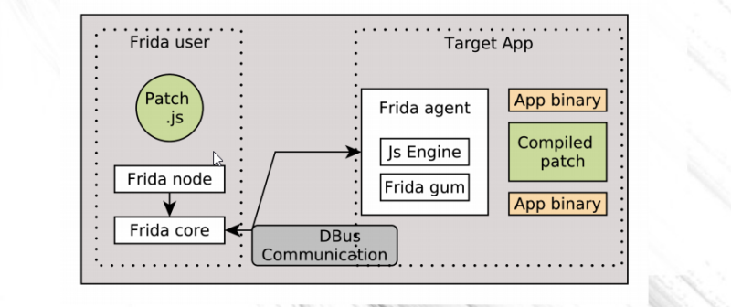

# What is Frida
Frida is a dynamic code instrumentation toolkit. It lets you inject your script into black-box processes(No source code needed). It allows you to inject your own code and to programmatically and interactively inspect and change running processes.

Frida, on the other hand, allows you to interact with the Android APK so you can inject code to bypass many of the techniques developers use to secure the apps. Some examples include bypassing the login screen to authenticate without a password or disabling SSL pinning to allow the hacker to see all the network traffic between your app and any backend servers.

Many of the method calls you make in your Android app can be hijacked or overridden by Frida for purposes that were never intended. By injecting JavaScript code, Frida can disable or enable a switch or pass fake parameters to gain access to information that would not otherwise be available.

## Prerequisites
Before starting with Frida, it is assumed that the reader has prior knowledge of Javascript. It would help to better Understanding of API calls and build your own custom tools

## How Frida Works?

First User have to create an file in which patching method written like Accessing any method value, or changing return value .
The patched method is sent from the computer of the User to the agent frida (installed on android device),
The agent being inserted in the application on the mobile.
And there, the patch (in js) is compiled and used to patch application



## Frida Android Set up 

## Little Intro
Given a process, frida allows us to intercept the memory of the process.
We can dump classes/modules/functions.
We can intercept functions/method invocation to read arguments / return values.
We can modify these arguments / return values --> allow us to do cool bypasses without having to recompile the target binary/application (oh no... all the packaging and jar signing nightmares...).

## Set Up
1. Install genymotion.
2. Install the app in genymotion
3. Check if device is accessible

```sh
$ pip install frida-tools
```
```sh
-> % adb devices
List of devices attached
192.168.56.101:5555	device
```
This means that the device is successfully connected via USB.

4. Shell access

```sh
-> % adb shell
vbox86p:/ #
```
Ok, we have shell access. Genymotion comes with root by default. Yay, no jail breaking needed!

5. Set up frida server inside android. It has to be inside android because we are going to intercept target process.

```sh
-> % frida-ps -U
Failed to enumerate processes: unable to connect to remote frida-server: closed
```
The above is what you get when frida server is not running.


Firstly, check your host's frida version. 
```sh
-> % frida --version
12.4.8
```

Secondly, check the architecture of the android with the adb shell like the following.
```sh
vbox86p:/tmp # uname -a
Linux localhost 4.4.34-genymotion #4 SMP PREEMPT Mon Oct 1 15:25:53 CEST 2018 i686
```

Taking note of the above frida version and the target architecture, we have to find the correct binary from [here](https://github.com/frida/frida/releases). I chosed `frida-server-12.4.8-android-x86.xz`, you have to choose the correct one depending on the above checks.

6. Extract with 7z and upload the file to android.

```sh
-> % adb push frida-server-12.4.8-android-x86 /tmp
frida-server-12.4.8-android-x86: 1 file pushed. 79.4 MB/s (32873600 bytes in 0.395s)
```


7. Run the frida server inside adb shell

```sh
vbox86p:/tmp # chmod +x frida-server-12.4.8-android-x86
vbox86p:/tmp # ./frida-server-12.4.8-android-x86 -l 0.0.0.0 -D
vbox86p:/tmp # ps -A | grep frida
root          4186     1   97064  56356 poll_schedule_timeout e85e1ba9 S frida-server-12.4.8-android-x86
root          4190  4186   13272   4720 poll_schedule_timeout ec079ba9 S frida-helper-32
```

8. Test if frida server is set up properly.

```sh
-> % frida-ls-devices
Id                   Type    Name
-------------------  ------  --------------------------
local                local   Local System
192.168.56.101:5555  usb     Genymotion APP-PT8.0
tcp                  remote  Local TCP

-> % frida-ps -U
 PID  Name
----  -----------------------------------------------
 154  adbd
 373  android.hardware.camera.provider@2.4-service
 374  android.hardware.configstore@1.0-service
 399  android.hardware.gnss@1.0-service
 375  android.hardware.graphics.allocator@2.0-service
 139  android.hardware.keymaster@3.0-service
 376  android.hardware.sensors@1.0-service
....
....

```

Cool. We're done with set up.

## View installed Apps

```sh
-> % frida-ps -Uai
 PID  Name                                           Identifier
----  ---------------------------------------------  ----------------------------------------------
 614  Android Keyboard (AOSP)                        com.android.inputmethod.latin
 504  Android System                                 android
1427  Blocked Numbers Storage                        com.android.providers.blockednumber
 504  Call Management                                com.android.server.telecom
2643  ConfigUpdater                                  com.google.android.configupdater
1427  Contacts Storage                               com.android.providers.contacts
 504  Fused Location                                 com.android.location.fused
2591  Google Partner Setup                           com.goog.............
```
I like to use this to find out the name of the app and its identifier.

## To launch an app

We can use the app's identifier as the filename to frida.

```sh
-> % frida -U -f com.android.calculator2 --no-pause
     ____
    / _  |   Frida 12.4.8 - A world-class dynamic instrumentation toolkit
   | (_| |
    > _  |   Commands:
   /_/ |_|       help      -> Displays the help system
   . . . .       object?   -> Display information about 'object'
   . . . .       exit/quit -> Exit
   . . . .
   . . . .   More info at http://www.frida.re/docs/home/
Spawned `com.android.calculator2`. Resuming main thread!
[Genymotion CENTURION-PT8.0::com.android.calculator2]->
```
We should see a calculator pop up inside genymotion. The above is a frida console shell that accept frida's javascript. This console is useful because of the autocomplete feature. We can use this console to help us build our frida javascript scripts.


# Frida Java API

Due to privacy, i will redact the actual app name with APP

The following is written by refering the Javascript API from [here](https://www.frida.re/docs/javascript-api/#java).

## Usage of callbacks

*Template of callback*

```javascript
var callback = { 
	'onMatch': function(arg1){ 
		console.log(arg1); 
	}, 
	'onComplete': function() {
		console.log("done"); 
	},
	'onError': function(){
		console.log("There is error");
	}
};

```
The above is how you can define a callback javascript object. The number of arguments passed does not matter. If the API invoke does not use up till the second / third /... parameter, those parameters will return as undefine.

## JVM Thread

Running most of frida's Java API code will require us to obtain the thread that has access to the VM.
There is a wrapper Java API that helps us achieve that.

```javascript
Java.perform(function(){
        //put what ever you would like to execute inside here.
});
```

With these, we can start enumerating the classes from our android app.

## Example

### Enumerating classes being loaded on runtime.

*enumclasses.js*
```javascript
var callback = {
	'onMatch': function(cname){
		//lets just print out the class name.
		console.log(cname);
	},
	'onComplete': function() {
		console.log("done");
	},
	'onError': function(){
		console.log("There is error");
	}
};

Java.perform(function(){
	Java.enumerateLoadedClasses(callback);	//onMatch: function (className)
});
```
The above will print out class names from the application.

```sh
-> % frida -U -f APP --no-pause -l enumclasses.js
     ____
    / _  |   Frida 12.4.8 - A world-class dynamic instrumentation toolkit
   | (_| |
    > _  |   Commands:
   /_/ |_|       help      -> Displays the help system
   . . . .       object?   -> Display information about 'object'
   . . . .       exit/quit -> Exit
   . . . .
   . . . .   More info at http://www.frida.re/docs/home/
Spawned `APP`. Resuming main thread!
[Genymotion APP-PT8.0::APP]-> org.apache.http.ProtocolVersion
org.apache.http.HttpResponse
org.apache.http.message.AbstractHttpMessage
org.apache.http.HttpHost
org.apache.http.conn.params.ConnPerRoute
org.apache.http.impl.conn.tsccm.RefQueueWorker
org.apache.http.conn.params.ConnManagerParams
org.apache.http.params.AbstractHttpParams
org.apache.http.impl.conn.IdleConnectionHandler
org.apache.http.conn.ConnectionReleaseTrigger
org.apache.http.HttpRequestInterceptor
org.apache.commons.logging.impl.WeakHashtable
org.apache.commons.logg......
....
```
Awesome! We can access class names. With this, we can start building on more actions we would like to take with the class name.

Note that the classes dumped are classes accessible by class loader during runtime.
Java uses lazy class loading which means that classes are only loaded when first encountered.
Hence, if an activity does not get executed, classes that are not yet encountered will not be dumped.

## Changing a class's method implementation

Supposed there is a method from a package ( `com.scottyab.rootbeer`) that check if a phone has been rooted using a method call ( `RootBeer.isRooted()` ).

Main idea:
1. We can access the class directly using its full name obtained by decompiling the apk.
2. Modify the implementation.
3. Trigger the correct Activity and appropriate sequence of actions to reach the code we are targetting --> the invocation will run our implementation instead of the actual compiled byte code.
( See others.md for starting hidden activities )

*BypassRoot.js*
```javascript
Java.perform(function(){
	//The Java "use" helps us load the class into memory --> return a javascript wrapper of the class.
	//we can access methods using dot notation and overwrite its implementation.
	var RootBeer = Java.use("com.scottyab.rootbeer.RootBeer");
	RootBeer.isRooted.implementation = function(){
		console.log("RootBeer isRooted returns false");
		return false;
	}

});
```
Basically, we are overwriting the method isRooted() to always return false.

```sh
-> % frida -U -p 6713 -l bypassrootcheck.js --no-pause 
     ____
    / _  |   Frida 12.4.8 - A world-class dynamic instrumentation toolkit
   | (_| |
    > _  |   Commands:
   /_/ |_|       help      -> Displays the help system
   . . . .       object?   -> Display information about 'object'
   . . . .       exit/quit -> Exit
   . . . .
   . . . .   More info at http://www.frida.re/docs/home/
                                                                                
[Genymotion APP-PT8.0::PID::6713]-> RootBeer isRooted returns false
RootBeer isRooted returns false
[Genymotion APP-PT8.0::PID::6713]->
```
The app Activity was started and frida was used to hook onto the specific running process via pid.
After performing the action that trigger the root check, we see that our console printed out "RootBeer isRooted returns false".


## Finding hidden Activity

Sometimes, an app has hidden activity that is not reachable from MAIN LAUNCHER.
We need to take a look at AndroidManifest.xml file to find all activities defined.

It is possible to draw a transition diagram to map out the transitions of the activities where the activities not found reachable by transitions are considered hidden ones.

## Accessing hidden Activity

Using Drozer shell, we can do a few cool tricks.

# Drozer Server

Like Frida server, our drozer server has to be on the android phone. Instead of command-line, drozer is a mobile app. Launching drozer will open up a random port that our drozer client can connect to. The APK can be downloaded from [here](https://labs.mwrinfosecurity.com/tools/drozer/).

### Connecting Drozer

```sh
-> % drozer console connect --server 192.168.56.101:31415
:0: UserWarning: You do not have a working installation of the service_identity module: 'No module named service_identity'.  Please install it from <https://pypi.python.org/pypi/service_identity> and make sure all of its dependencies are satisfied.  Without the service_identity module, Twisted can perform only rudimentary TLS client hostname verification.  Many valid certificate/hostname mappings may be rejected.
Selecting bb136700a5ee361e (Genymotion APP-PT8.0 8.0.0)

            ..                    ..:.
           ..o..                  .r..
            ..a..  . ....... .  ..nd
              ro..idsnemesisand..pr
              .otectorandroidsneme.
           .,sisandprotectorandroids+.
         ..nemesisandprotectorandroidsn:.
        .emesisandprotectorandroidsnemes..
      ..isandp,..,rotectorandro,..,idsnem.
      .isisandp..rotectorandroid..snemisis.
      ,andprotectorandroidsnemisisandprotec.
     .torandroidsnemesisandprotectorandroid.
     .snemisisandprotectorandroidsnemesisan:
     .dprotectorandroidsnemesisandprotector.

drozer Console (v2.4.4)
dz> help

drozer: Android Security Assessment Framework

Type `help COMMAND` for more information on a particular command, or `help
MODULE` for a particular module.

Commands:

cd     contributors  env   help  load    permissions  set    unset
clean  echo          exit  list  module  run          shell

Miscellaneous help topics:

intents

dz> list
app.activity.forintent                  Find activities that can handle the given intent                          
app.activity.info                       Gets information about exported activities.                               
app.activity.start                      Start an Activity                                                         
app.broadcast.info                      Get information about broadcast receivers                                 
app.broadcast.send                      Send broadcast using an intent                                            
app.broadcast.sniff                     Register a broadcast receiver that can sniff particular intents           
app.package.attacksurface               Get attack surface of package                                             
app.package.backup                      Lists packages that use the backup API (returns true on FLAG_ALLOW_BACKUP)
app.package.debuggable                  Find debuggable packages                                                  
app.package.info                        Get informa..........
...............

```

By looking at the commands listed above, we can see that drozer can be used for information gathering / sending intents without having to build an app / starting activities...


### Some Drozer Commands

Showing permissions
```sh
dz> run app.package.info -f <app name>
```

Find out exported activities
```sh
dz> run app.activity.info -a <app identifier>
```

Start the exported activity
```sh
dz> run app.activity.start --component <app identifier> <activity full qualified name>
```

Finding attack surface
```sh
run app.package.attacksurface
```


